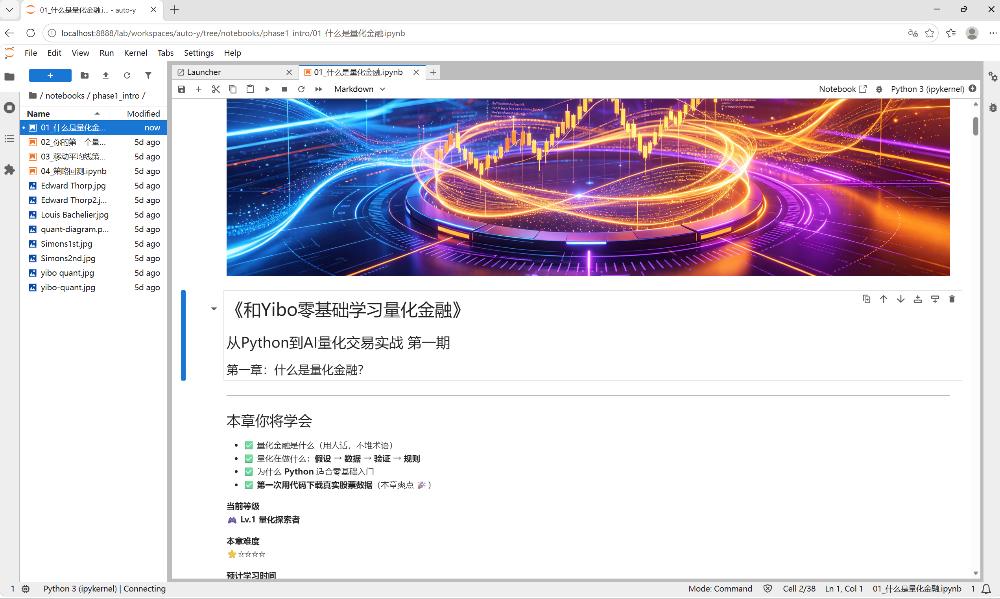

# Task1 环境配置 学习笔记

## 1. 今天学的 Task
Task1《环境配置》—— 搭建本地 Quant 量化学习环境，为后续 Phase1/Phase2 的 Jupyter Notebook 课程做准备。

## 2. 完成了哪些课程要求
- 用 conda 创建了独立虚拟环境 `Quant`（安装在 `D:\miniconda\envs\Quant`，不占 C 盘）
- 在该环境中安装了课程所需依赖：`jupyter`、`numpy`、`pandas`、`matplotlib`、`seaborn`、`yfinance`、`akshare`、`scikit-learn`
- 将 `quant-for-beginners` 仓库克隆/放到本地目录
- 成功启动 Jupyter Lab 并在浏览器打开，能看到 `notebooks/phase1_intro/`、`phase2_intro/` 等课程文件结构

## 3. 运行结果 / 学习记录
成功启动 Jupyter Lab 并在浏览器打开：

## 4. 还没完全懂的问题
Jupyter Lab 是通过一个后台进程 + `token` 认证的本地服务运行的，但我还不太清楚：
- 这个 token 机制具体是防止什么风险的（局域网内其他人能访问吗）？
- 为什么关闭终端窗口/进程被系统回收后服务就直接中断了，有没有更稳定的常驻后台方式（比如作为服务运行）？