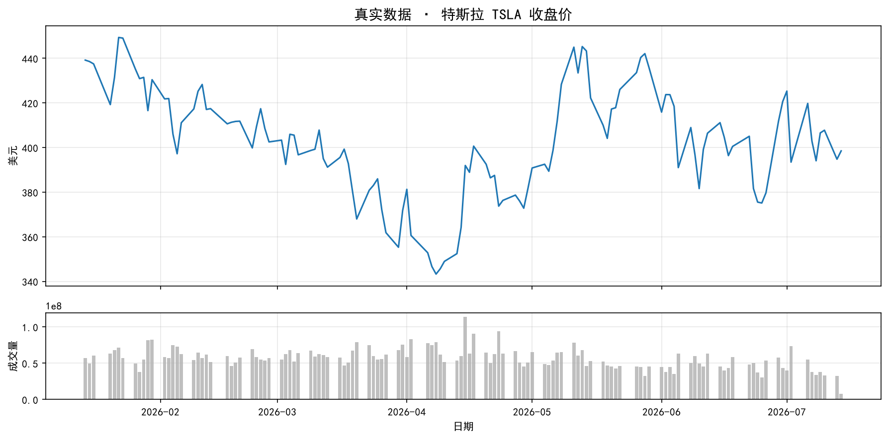
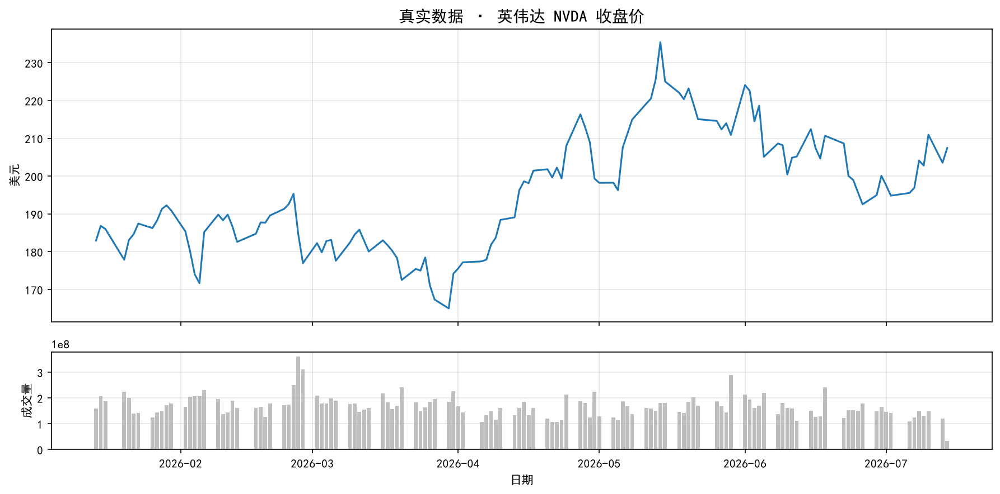
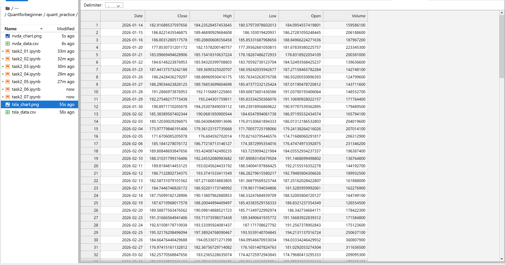

# Task2 第一章：什么是量化金融 学习笔记

## 1. 今天学的 Task
Task2《第一章：什么是量化金融》。

## 2. 完成了哪些课程要求
- 理解了"量化金融"到底在干什么：不是靠感觉猜涨跌，而是**提出假设 → 量化定义 → 历史数据验证 → 沉淀成规则**这一套闭环流程，跟写代码时"提需求 → 定义接口 → 跑测试 → 上线"的思路其实很像，代入感很强
- 理解了为什么量化圈几乎都用 Python：生态最全（pandas/numpy/yfinance 一条龙）、开发效率高（一行 `df['MA5'] = df['Close'].rolling(5).mean()` 顶 C++ 几十行），这点作为学过一点 C 语言的人感受很直接
- 尝试了两个模拟实验：
  - **实验一（布朗运动/随机游走）**：让 50 只"虚拟股票"同时从 100 元出发随机走 250 天，观察到单条路径完全不可预测，但整体统计规律（正态分布、波动与 √t 成正比）是稳定的
  - **实验二（索普的概率优势 + 凯利公式）**：对比无优势玩家、有优势+凯利仓位玩家、有优势但下注激进玩家三种情况的 1000 轮模拟结果，理解了"光有优势不够，仓位管理同样重要"
- 学会下载真实股票数据：用 `yfinance` 一行代码 `yf.download('AAPL', period='6mo')` 拉到了苹果公司真实的近 6 个月股票日线数据，并画出了价格+成交量的图
- 完成了挑战任务：把股票代码换成 TSLA（特斯拉），重新跑了一遍下载和画图流程

## 3. 实验运行结果
TSLA股票数据的输出：

完整数据表格：[tsla_data.csv](quant_practice/tsla_data.csv)

NVDA股票数据的输出：

完整数据表格：[nvda_data.csv](quant_practice/nvda_data.csv)

## 4. 学习记录
实验记录：

阅读教材时同步做的梳理笔记：[task2——chapter01什么是量化金融.md](task2——chapter01什么是量化金融.md)

## 5. 一个还没完全懂的问题
实验二里的**凯利公式** `f* = (bp - q) / b` 只在代码里给了公式和结果对比，还没完全搞懂它是怎么推导出来的——为什么这个特定的仓位比例就是"数学上最优"的？这个问题准备留到后面章节或者自己查资料补一下。
不过公式本身怎么推导出来的其实不是这一章的重点，重点应该是原文强调的底层量化逻辑：**概率优势 × 仓位管理 × 长期纪律 = 量化盈利的完整公式**——凯利公式只是"仓位管理"这一环具体的数学实现，重点是理解这个逻辑框架。
