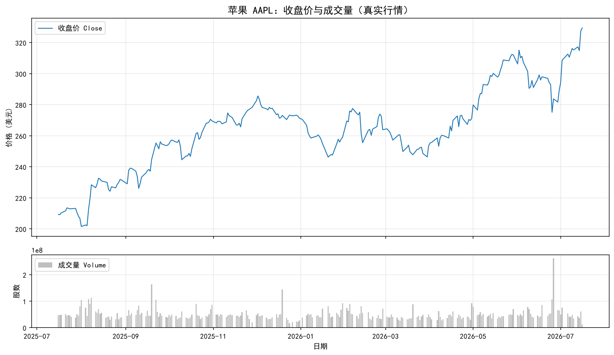
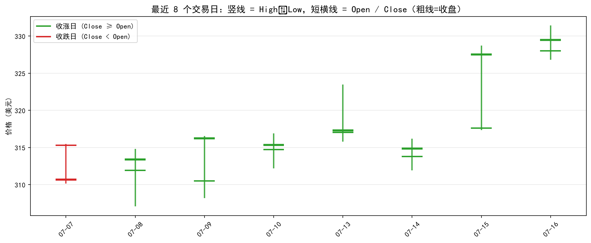
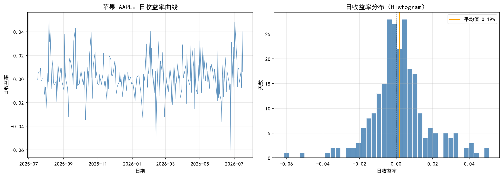
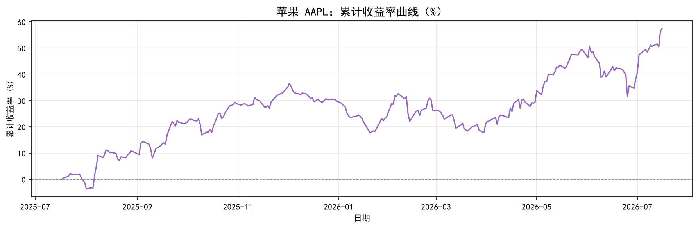
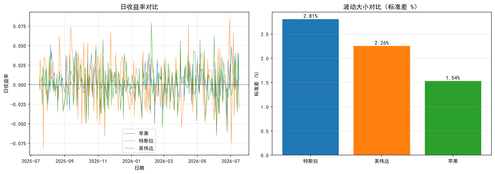
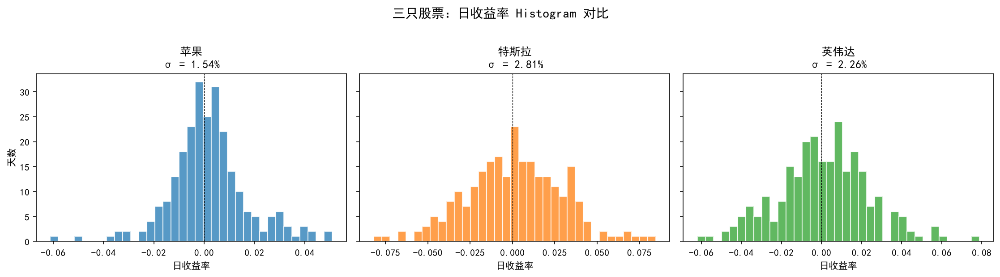
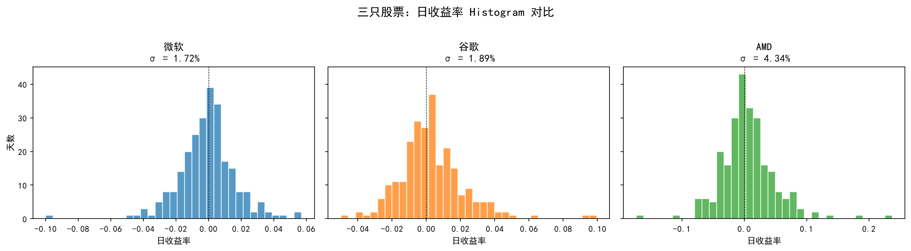
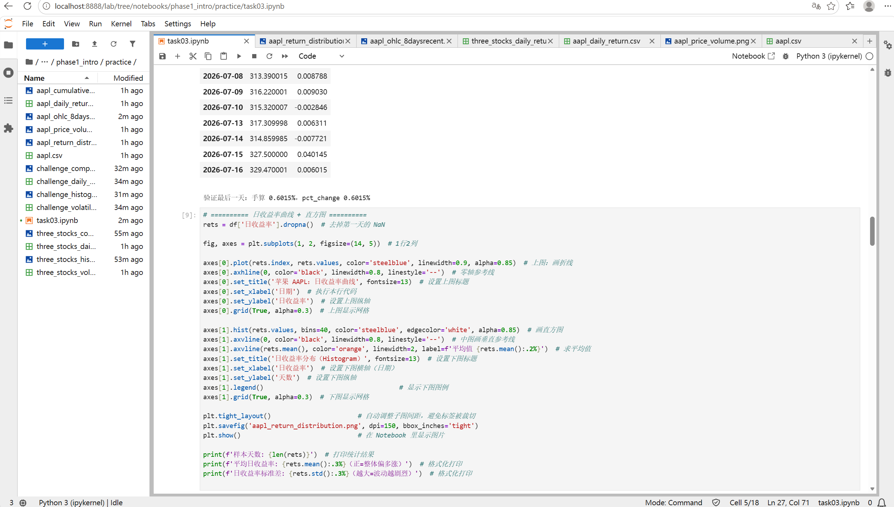

# Task3 第二章：你的第一个量化实验 学习笔记

## 1. 今天学的 Task
Task3《第二章：你的第一个量化实验》。这一章正式进入"数据分析"部分，跟第一章偏概念/故事性不同，这一章基本全程在写 pandas + matplotlib 代码，对我这种平时写代码比看文字更有感觉的人来说，上手更快。

## 2. 完成了哪些课程要求
- 认识了股票日线数据的标准结构 **OHLCV**（开盘 Open / 最高 High / 最低 Low / 收盘 Close / 成交量 Volume），理解了为什么量化里默认用 **Close** 做分析——因为它代表当天"最终定价"
- 理解了**收益率**的定义：不是看涨了多少钱，而是看"相对昨天涨了多少比例"。先用 100→110 的生活例子建立直觉，再对上公式 $r_t = (P_t - P_{t-1}) / P_{t-1}$，这个"先例子后公式"的讲法比直接甩公式好理解很多
- 用 pandas 一行代码 `df['日收益率'] = df['Close'].pct_change()` 算出了整列日收益率，并手算验证了最后一天的结果，两者完全对得上
- 画了四张图，理解了它们各自在看什么：
  - **收盘价+成交量图**：看整体走势和资金活跃度
  - **8天 OHLC 示意图**：看单日内开高低收的关系（涨用绿、跌用红）
  - **日收益率曲线 + Histogram**：曲线看每天涨跌的时间序列，直方图看涨跌幅度的分布集中在哪
  - **累计收益率曲线**：把每天的涨跌"复利"起来，看这段时间总共赚了/亏了多少
- 完成了"谁波动更大"的小实验：用日收益率的**标准差**衡量波动大小，对比了 AAPL / TSLA / NVDA 三只股票
- 完成了挑战任务（详见第3部分）：换成自己感兴趣的公司重做实验、保存 Histogram 截图、回答厚尾问题

## 3. 运行结果

### AAPL 基础实验

获取日线行情数据：[aapl.csv](quant_practice/task03/aapl.csv)

完整数据（含日收益率）：[aapl_daily_return.csv](quant_practice/task03/aapl_daily_return.csv)

最近一段时间的收盘价与日收益率（`aapl_daily_return.csv` 最后几行）：

| Date       | Close  | 日收益率   |
| ---------- | ------ | ------ |
| 2026-07-10 | 315.32 | -0.28% |
| 2026-07-13 | 317.31 | +0.63% |
| 2026-07-14 | 314.86 | -0.77% |
| 2026-07-15 | 327.50 | +4.01% |
| 2026-07-16 | 329.47 | +0.60% |

- 
- 
- 
- 

### 波动对比实验（AAPL / TSLA / NVDA）

| 股票       | 日收益率标准差（波动） |
| -------- | ----------- |
| 特斯拉 TSLA | 2.81%       |
| 英伟达 NVDA | 2.26%       |
| 苹果 AAPL  | 1.54%       |

数据：[three_stocks_daily_returns.csv](quant_practice/task03/three_stocks_daily_returns.csv) ・ [three_stocks_volatility.csv](quant_practice/task03/three_stocks_volatility.csv)

### 挑战任务
**挑战1**：换成自己感兴趣的公司重做实验——选了三家跟计算机专业相关的科技公司：**微软 MSFT、谷歌 GOOGL、AMD**

数据：[challenge_daily_returns.csv](quant_practice/task03/challenge_daily_returns.csv) ・ [challenge_volatility.csv](quant_practice/task03/challenge_volatility.csv)

| 股票 | 日收益率标准差（波动） |
|------|----------------------|
| AMD | 4.34% |
| 谷歌 GOOGL | 1.89% |
| 微软 MSFT | 1.72% |

规律和 AAPL/TSLA/NVDA 那组一致：芯片股（AMD、NVDA）波动明显比软件/平台巨头（微软、苹果）大，体现芯片行业周期性强，又容易被 AI 概念炒作影响。

**挑战2**：保存 Histogram 截图

**挑战3**：思考题——Histogram 尾巴很长说明什么？

实际算了一下偏度（skew）和峰度（kurtosis）：三只股票的峰度都在 4.1～4.8 之间，明显大于正态分布的基准值 3。这说明收益率分布是大部分日子涨跌幅度很集中，但两端偶尔出现的暴涨暴跌天数，比正态分布预测的要多得多。结合超过2倍标准差的"极端交易日"占比（4%～5.2%），说明这类股票偶尔会有远超日常波动范围的极端行情，通常是财报暴雷、突发新闻或者概念炒作导致的。这提醒我们：如果拿正态分布去做风险管理，会低估真实市场的极端风险。

## 4. 学习记录
遇到的报错：
- **变量在不同 notebook / kernel 之间不互通**：我曾经在一个新建的 notebook 里测试 `pd.read_csv`，误以为这样就能让原来那个画图的 notebook 也拿到正确数据，结果画出来是空图——因为每个 notebook 有自己独立的 kernel（独立内存），变量名一样也不是同一个变量
- **Jupyter 的输出是"跑一次定格一次"**：修好了数据变量之后，之前那个已经跑过的画图 cell 不会自动刷新，必须手动重新运行一遍才会用上新数据
- **雅虎限流是服务器端的，跟本地环境无关**：重启电脑、重启 Jupyter 都没用，可以换个网络环境、或者等限流窗口过去；也可以另外开一个新的 Python 进程在本地把数据下载好存成 csv，再回到 Jupyter 里重新运行读取数据的代码，然后画图。

实验记录：

阅读教材时同步做的梳理笔记：[task3_第一个量化实验.md](task3_第一个量化实验.md)
## 5. 一个还没完全懂的问题
`pct_change()` 算的是"相对上一行"的变化率，那如果数据里有缺失的交易日（比如停牌、节假日导致的日期不连续），pandas 会不会因为把"上一行"当成"昨天"而算出一个跨越了好几天的收益率、但看起来像是"一天"的涨跌？这个数据完整性的问题现在还没搞清楚该怎么验证和处理，准备后面找时间专门测试一下。
