# Task4 第三章：移动平均线策略 学习笔记

## 1. 今天学的 Task
Task4《第三章：移动平均线策略》。
## 2. 完成了哪些课程要求
- 理解了行情的三种状态：**上涨趋势 / 下跌趋势 / 噪声（横盘）**，用模拟数据分区上色画出来后，很直观地看出"噪声"就是每天乱跳、整体方向不明显的那种走势
- 理解了为什么要用**移动平均线（Moving Average）**：策略真正关心的是整体趋势，而不是每天的抖动，用最近 n 天收盘价的算术平均把"乱"的价格磨平，才能看清方向
- 用 pandas 一行代码 `df['Close'].rolling(n).mean()` 算出了 MA5、MA20，并对比原始收盘价和 MA20 曲线，直观感受到均线越平滑
- 下载了茅台（600519）近 2 年的行情数据，算出 MA5、MA20，画出收盘价 + 两条均线的图
- 理解了**金叉 / 死叉**：MA5（短期均线）从下往上穿过 MA20（长期均线）叫金叉，代表短期变强，是做多参考信号；反过来从上往下穿叫死叉，是做空/离场参考信号，并在图上标注出了具体位置
- 完成了第一个策略规则：**MA5 > MA20 则持仓，否则空仓**，用 `signal` 列记录每天是否该持仓，用 `trade` 列记录金叉/死叉发生的那一天
- 画出了完整的策略信号大图：上半部分是价格+均线+买卖点（▲买入 / ▼卖出），下半部分是一条持仓状态色带，还单独放大了近 6 个月看细节
- 完成了挑战任务（详见第3部分）：换成宁德时代（300750）重做一遍全流程、对比 MA10/MA30 与 MA5/MA20 的信号次数、思考"金叉是否一定赚钱"

## 3. 运行结果

### 行情趋势与移动平均线（基础概念部分）

三种市场状态模拟图（绿=上涨、红=下跌、灰=噪声）：

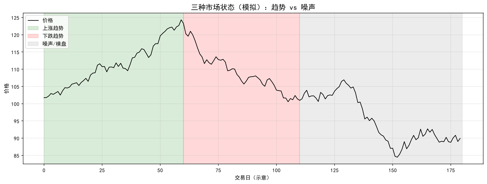

原始收盘价 vs MA20 平滑对比图：

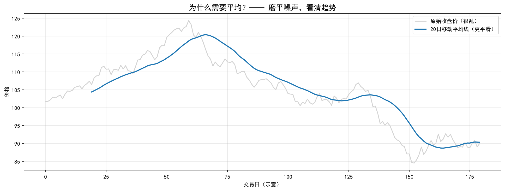

### 茅台（600519）基础实验

获取行情数据并计算 MA5、MA20：[ma_data.csv](quant_practice/task04/ma_data.csv)

- 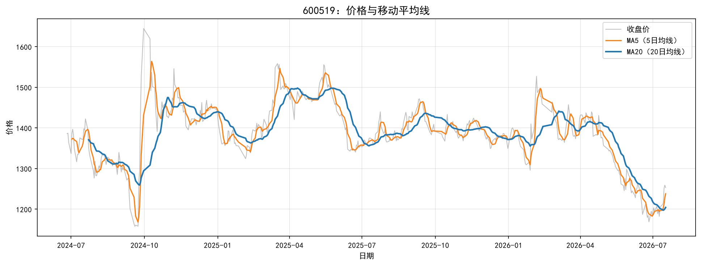
- 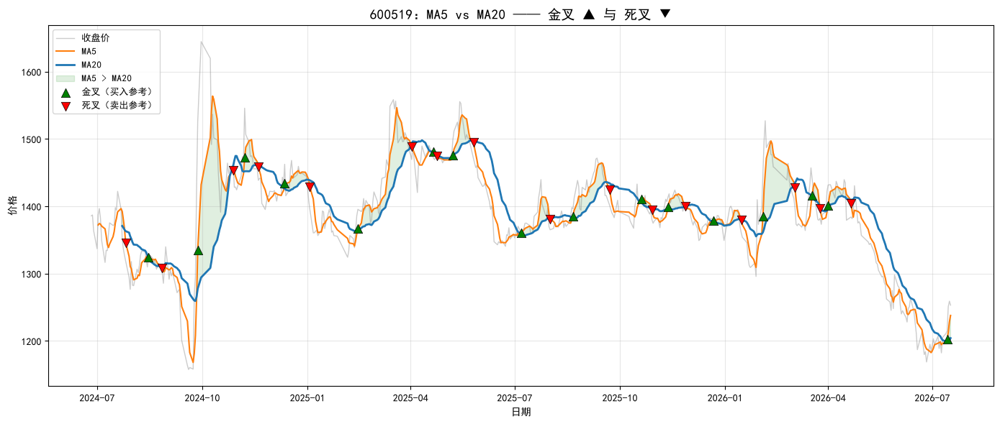

样本期内 **金叉 16 次，死叉 16 次**（共约 500 个交易日，出现 32 次调仓信号）。

调仓信号明细表：[trade_signals.csv](quant_practice/task04/trade_signals.csv)

- 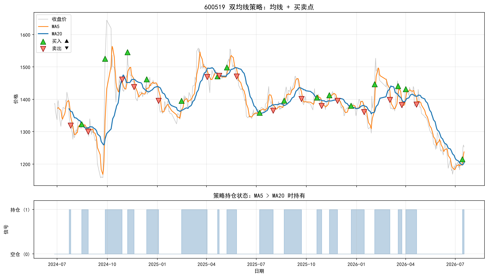
- 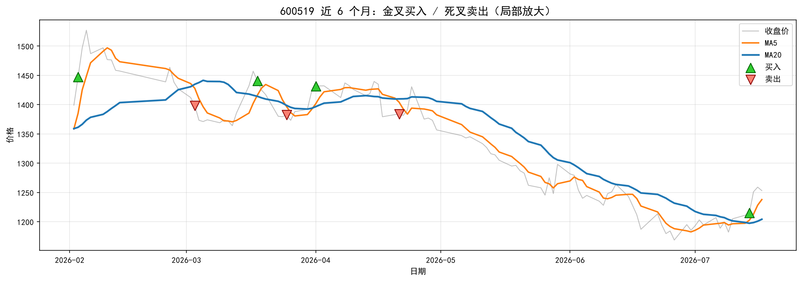

### 挑战任务

**挑战1**：把股票换成自己感兴趣的公司——选了跟新能源相关的**宁德时代（300750）**，用国内数据源重跑了一遍完整流程

数据：[ndsd_ma_data.csv](quant_practice/task04/ndsd_ma_data.csv) ・ 调仓信号：[ndsd_trade_signals.csv](quant_practice/task04/ndsd_trade_signals.csv)

- 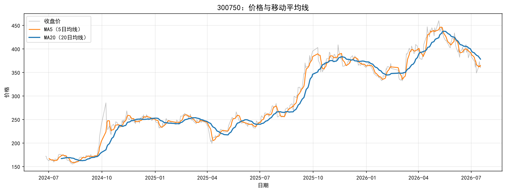
- 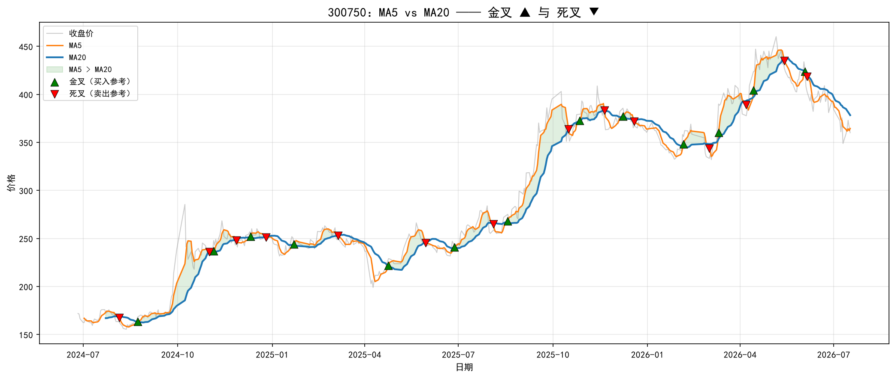
- 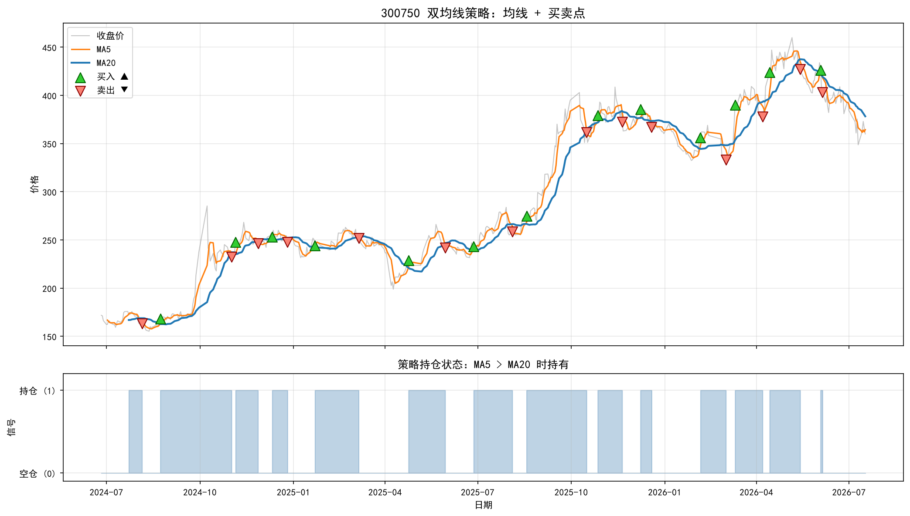
- 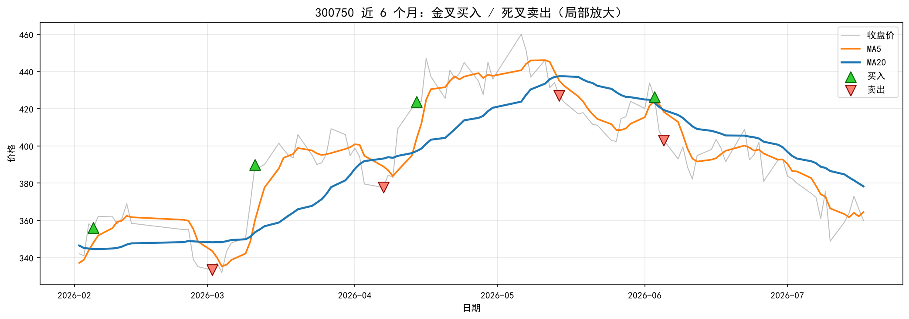

样本期内 **金叉 13 次，死叉 14 次**。

**挑战2**：试试 MA10 vs MA30，和 MA5/MA20 对比买卖次数变化（在宁德时代这份数据上跑的）

数据：[challenge2_ma10_ma30_300750.csv](quant_practice/task04/challenge2_ma10_ma30_300750.csv)

| 均线组合 | 金叉次数 | 死叉次数 | 合计信号 |
|---------|---------|---------|---------|
| MA5 / MA20 | 13 | 14 | 27 |
| MA10 / MA30 | 9 | 10 | 19 |

- 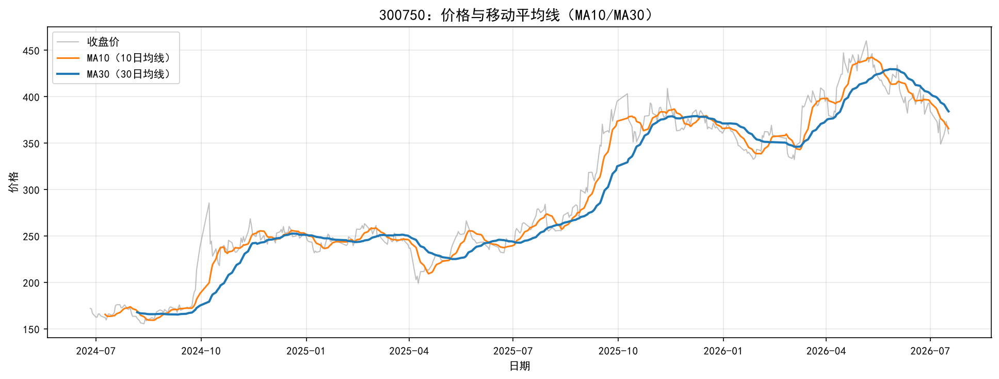
- 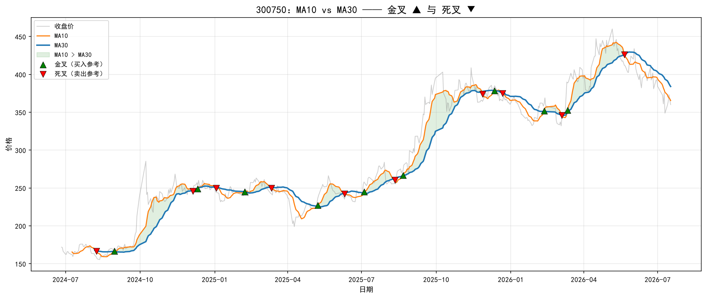
- 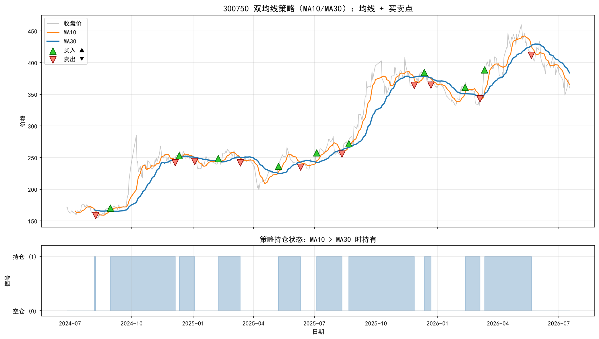

结论：均线周期变长（MA10/MA30 比 MA5/MA20 长），交叉次数明显变少（19 次 vs 27 次）。因为长周期均线更平滑，对短期价格抖动不敏感。

**挑战3**：思考题——金叉一定赚钱吗？为什么第四章要做回测？

金叉不一定赚钱。金叉只是"MA5 刚刚由下往上穿过 MA20"这个**统计现象** ，代表短期均价开始高于长期均价，有**滞后**性——它是根据过去的价格算出来的，不代表未来一定延续同样的方向。正因为"感觉上应该赚钱"不等于"实际测试后真的赚钱"，所以后面要做**回测**：把这套金叉买入、死叉卖出的规则完整套在历史数据上跑一遍，用真实的胜率、总收益、最大回撤这些数字去验证策略是否真的有效，而不是凭直觉判断。

## 4. 学习记录
遇到的问题：
- **画图 cell 复用变量名时容易漏改**：换成宁德时代重跑实验时，一开始只改了下载数据那一格的 `SYMBOL`，却忘了后面画图的 cell（比如策略信号大图）里还要重新跑一遍金叉死叉检测和 signal/trade 计算，因为这些中间变量不会因为 `df` 换了内容就自动更新，必须按顺序把依赖的 cell 全部重新跑一遍
- **下载数据和后续计算是分开的两步**：算 MA10、MA30 这种新指标时，不需要重新联网下载数据，只要在已经下载好的 `df` 上新增列、基于同一份 `Close` 数据计算就行，一开始容易搞混以为每加一个新均线都要重新下载一次

实验记录：

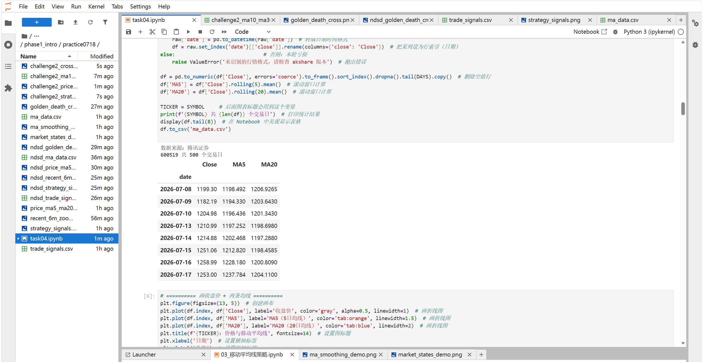

阅读教材时同步做的梳理笔记：[task04-移动平均线策略.md](task04-移动平均线策略.md)

## 5. 一个还没完全懂的问题
金叉死叉的判断用的是 `np.sign(spread).diff()` 这种"符号变化"的方式，如果 MA5 和 MA20 刚好在某一天完全相等（spread=0），下一天符号是从 0 变成正/负，这种情况会被正确识别成金叉/死叉吗？还是说 0 这个中间状态会导致漏判或者多判一次？这个边界情况现在还没搞清楚要怎么验证，准备后面找时间专门测试一下。
