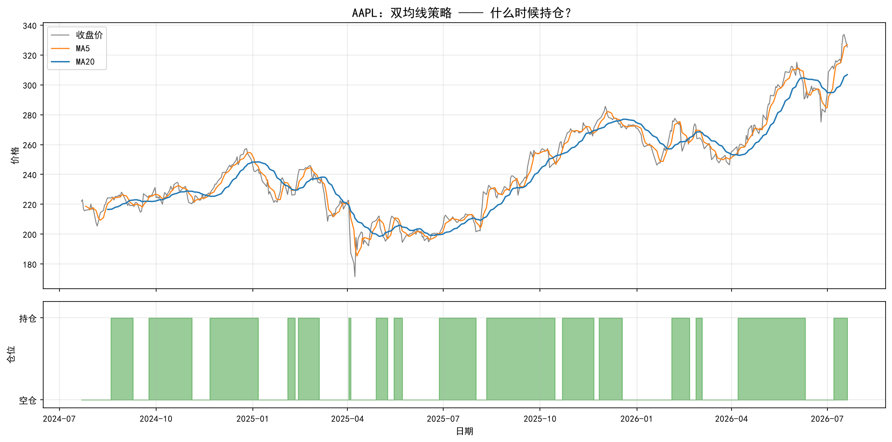
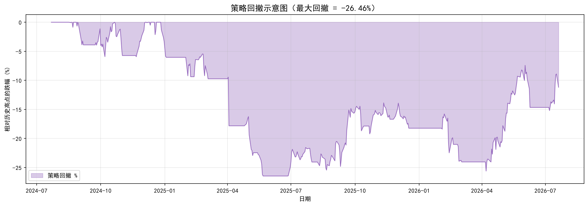
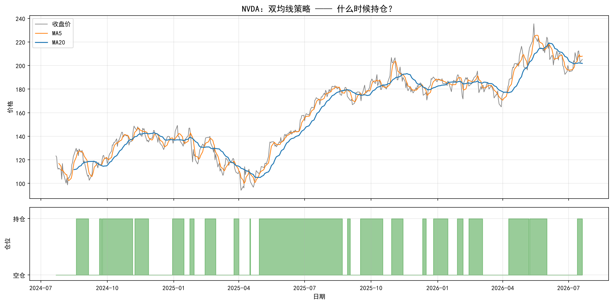
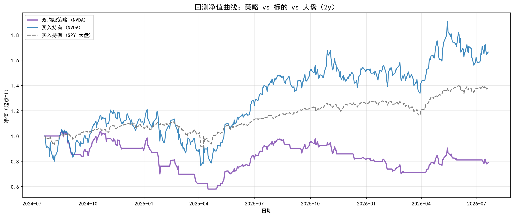
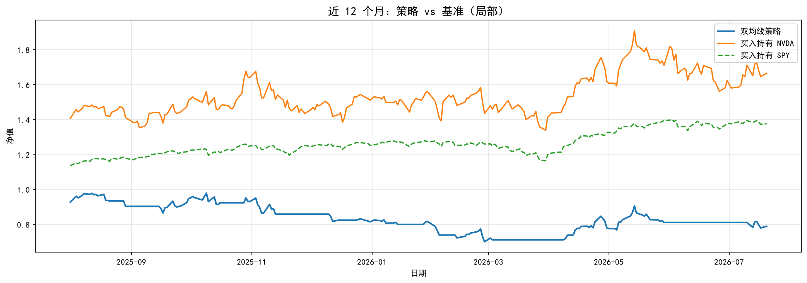
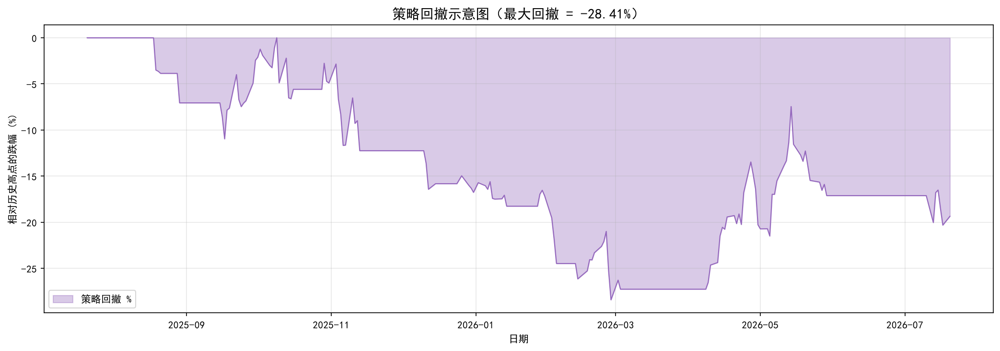
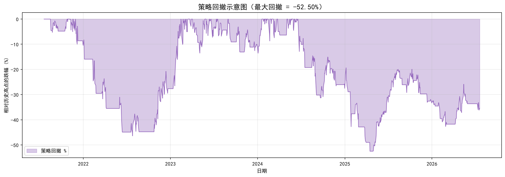
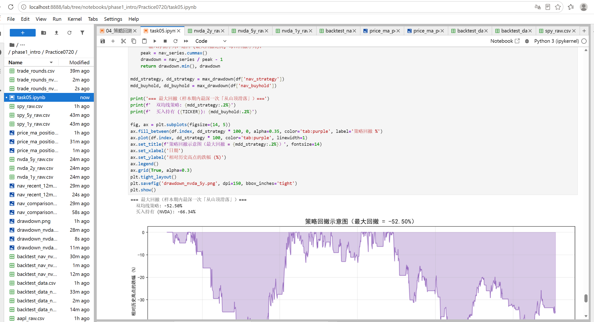

# Task5 第四章：策略回测 学习笔记

## 1. 今天学的 Task
Task5《第四章：策略回测》。

## 2. 完成了哪些课程要求
- 理解了**回测**是什么：拿历史数据假装当时真的按规则交易了一遍，用来"体检"策略，不是用来"算命"预测未来
- 理解了怎么用代码模拟真实交易的三件事——**买入 → 持仓 → 卖出**，用 `position` 列（1=持仓，0=空仓）表示，并且用 `shift(1)` 把信号往后推一天，避免"偷看未来数据"
- 学会了算**策略收益**：`策略日收益 = 仓位 × 日收益率`，只有持仓那天的涨跌才算到自己头上，再把每天的收益连乘起来得到**净值曲线**
- 同时对照了两条基准曲线：**买入持有（同标的）** 和 **买入持有（SPY 大盘）**，用来判断策略是不是真的比"什么都不做"或者"买指数"更强
- 画出了完整的回测净值对比图（策略 vs 买入持有 vs 大盘），以及近12个月的局部放大图
- 学会了统计**胜率**：一轮完整的"买入→卖出"算一局，赢的次数 ÷（赢+输）
- 学会了算**最大回撤**：净值从历史最高点最多跌了多少，衡量这套策略历史上最难受的时候有多难受
- 完成了挑战任务（详见第3部分）：换成 NVDA 重跑一遍完整回测流程、对比 1年期 vs 5年期的最大回撤、用三句话向朋友解释"回测是什么"

## 3. 运行结果

### AAPL（默认标的）基础实验

获取数据并计算双均线、标记买卖点：[backtest_data.csv](quant_practice/task05/backtest_data.csv)

样本期内 **500 个交易日，买入 16 次，卖出 15 次**。

- 

样本期累计收益（不含手续费）：

| | 累计收益 |
|---|---|
| 双均线策略 (AAPL) | -3.43% |
| 买入持有 (AAPL) | +46.53% |
| 买入持有 (SPY 大盘) | +37.52% |

胜率：15 轮完整交易，赢 5 次、输 10 次，**胜率 33.3%**。数据：[trade_rounds.csv](quant_practice/task05/trade_rounds.csv)

最大回撤：策略 **-26.46%**，买入持有(AAPL) **-33.36%**。

- 

这组基础实验一开始就直接印证了教材那句话："过去有效不代表未来一定有效"——AAPL 这段时间**买入持有反而比均线策略赚得多**，均线策略来回买卖，把不少涨幅"卖飞"了。

### 挑战任务

**挑战1**：把 `TICKER` 换成 **NVDA**，重跑一遍完整回测流程

数据：[backtest_data_nvda.csv](quant_practice/task05/backtest_data_nvda.csv) ・ [backtest_nav_nvda.csv](quant_practice/task05/backtest_nav_nvda.csv)

样本期内 **500 个交易日，买入 20 次，卖出 19 次**。

- 
- 
- 

样本期累计收益：

| | 累计收益 |
|---|---|
| 双均线策略 (NVDA) | -21.14% |
| 买入持有 (NVDA) | +66.42% |
| 买入持有 (SPY 大盘) | +37.52% |

结论：**策略明显跑输**，不仅跑输大盘，连"买了 NVDA 就一直拿着不动"都跑输了将近 88 个百分点。

**挑战2**：对比 `PERIOD='1y'` 和 `'5y'`，看最大回撤谁更深

数据：[drawdown_nvda_1y.png](quant_practice/task05/drawdown_nvda_1y.png) ・ [drawdown_nvda_5y.png](quant_practice/task05/drawdown_nvda_5y.png)

| PERIOD | 交易日数 | 策略最大回撤 | 买入持有最大回撤 |
|--------|---------|------------|----------------|
| 1y | 251 | **-28.41%** | -20.21% |
| 5y | 1255 | **-52.50%** | -66.34% |

- 
- 

**5y 回撤更深**——样本拉长后会把更极端的下跌行情也包进来，历史最高点和最低谷的落差自然更大。不过对比买入持有那一列也发现一个有意思的地方：5y 里买入持有的回撤（-66.34%）比策略本身还深，说明拉长周期看，均线策略其实帮忙"减了震"；而 1y 里正好反过来，策略回撤（-28.41%）比买入持有（-20.21%）还深，说明短期内策略频繁调仓反而不如躺平稳。

**挑战3**：用三句话向朋友解释「回测是什么」

回测就是拿历史上已经发生过的价格数据，假装自己当时真的按照某个规则买卖了一遍，看账户最后是赚是亏。它不能预测未来，只能告诉你"这套规则在过去这段时间表现怎么样"，过去表现好不代表以后也一定好。做回测的意义在于真金白银投进去之前，先看看这套策略靠不靠谱。

## 4. 学习记录
遇到的问题：
- **雅虎限流**：Cell 里直接 `yf.download('AAPL', ...)` 又遇到 `YFRateLimitError`，跟前几章一样，换成本地先用独立脚本把数据下载好存成 csv，再回 Jupyter 里用 `pd.read_csv` 读取，后面的代码完全不用改
- **多次改 TICKER/PERIOD 重跑，中间数据串了**：做挑战2 对比 1y/5y 时，一开始忘了把 Cell4 的 `PERIOD` 和 Cell7 读取的 csv 文件名一起改，导致算出来的还是上一次的数据；后来才意识到这两个地方必须同步改，并且要从环境准备那格开始依次往下重跑，不能只跑中间某一个 cell

实验记录：

阅读教材时同步做的梳理笔记：[task05——回测.md](task05——回测.md)

## 5. 一个还没完全懂的问题
挑战2 里发现：5年期里策略的最大回撤（-52.50%）比买入持有（-66.34%）还小，也就是说长周期下均线策略反而比"啥也不干"更抗跌；但1年期里正好相反，策略回撤（-28.41%）比买入持有（-20.21%）更深。这是否说明"均线策略能否减少回撤"好像跟样本周期长短有关？
