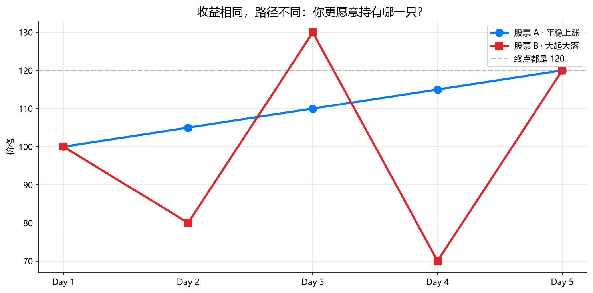
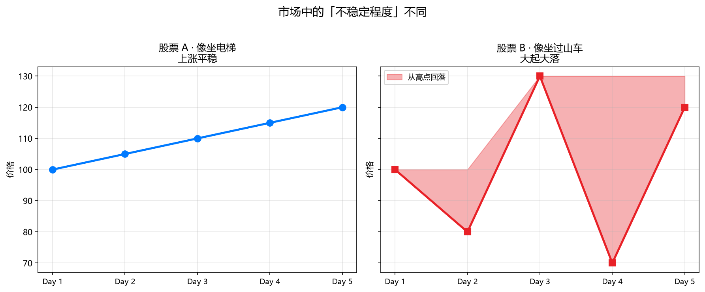
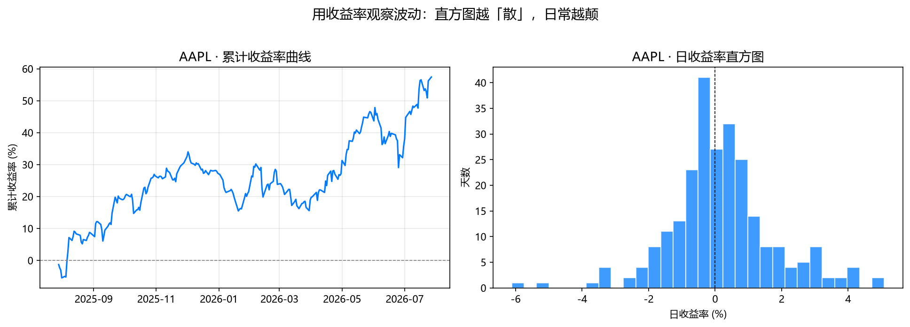
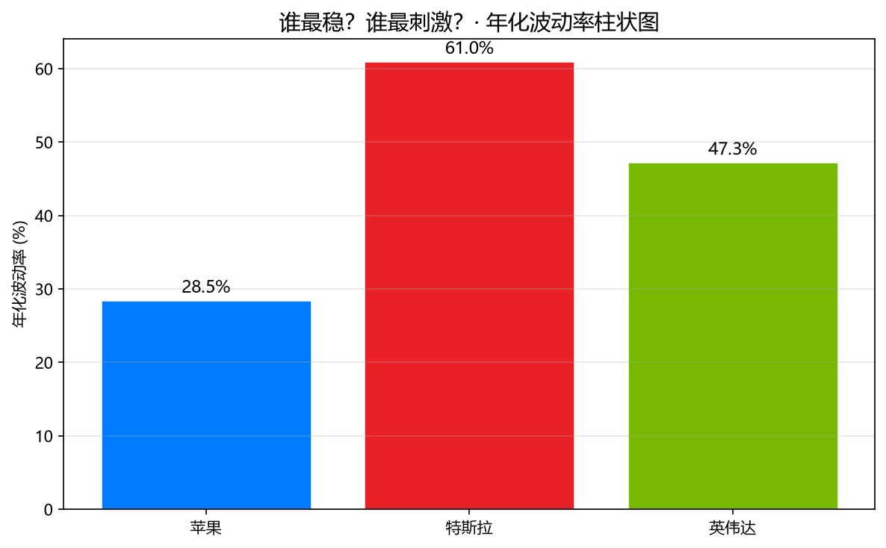
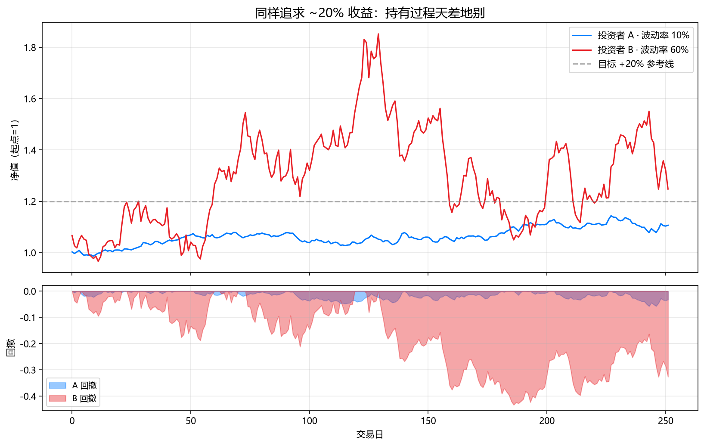
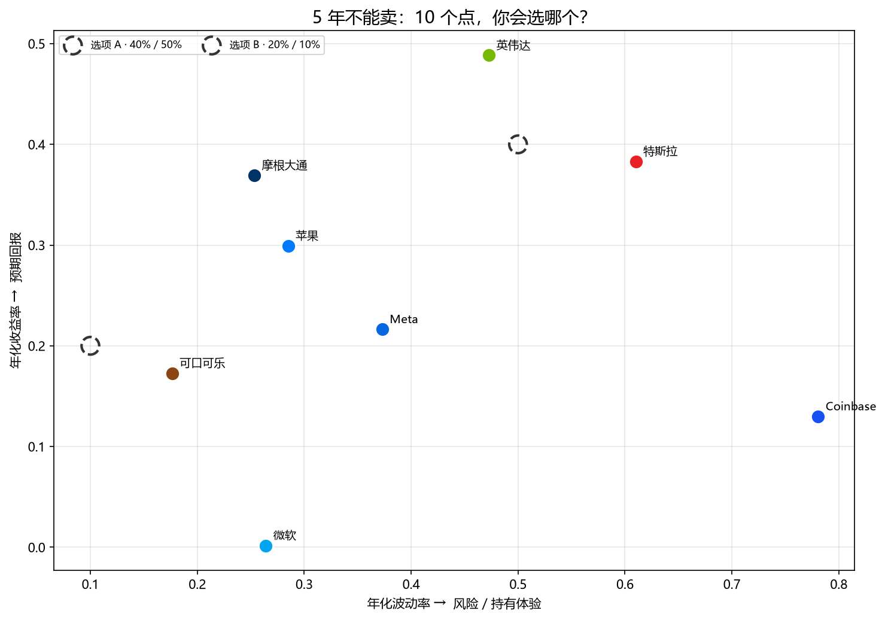
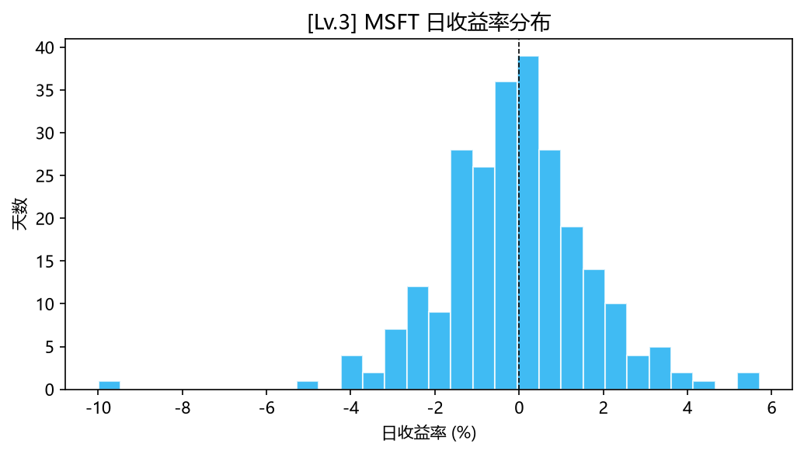
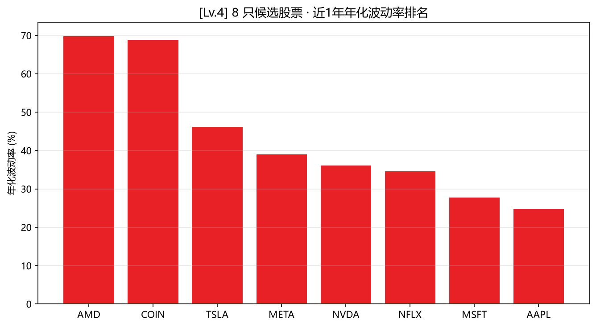
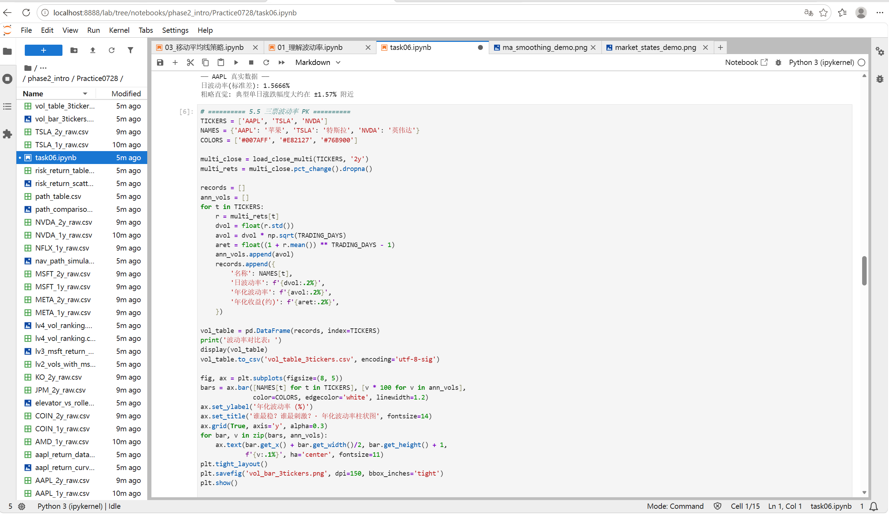

# Task6 第五章：理解波动率 学习笔记

## 1. 今天学的 Task
Task6《第五章：理解波动率》（Phase 2 风险与组合管理开篇）。

## 2. 完成了哪些课程要求
- 理解了**收益相同、体验可以天差地别**：两只股票 5 天后都涨 20%，一只平稳上涨、一只大起大落，感受完全不一样
- 理解了为什么量化研究看**收益率**而不是**价格**：不同股价基数下涨跌幅不能直接比，收益率才能横向比较
- 学会了用**标准差**近似**波动率**：`returns.std()`，收益率越分散标准差越大，波动率越高
- 学会了**年化波动率**的算法和意义：`日标准差 × √252`，把「日尺度」换算成大家都看得懂的「年尺度」
- 用真实数据对比了 AAPL / TSLA / NVDA 三只股票的日波动率、年化波动率
- 用模拟净值曲线直观看到：**同样追求 20% 收益，波动率不同，持有过程和最大回撤天差地别**
- 完成了 8 只股票 + 2 个虚构选项的风险-收益散点图
- 完成了挑战任务（详见第3部分）：换一只股票算年化波动率、把 MSFT 加进三票对比、画收益率分布图、8 选 1 找出近 1 年波动率最高的股票

## 3. 运行结果

### 基础实验

**5.1 两种路径，同一终点**：股票 A（平稳上涨）和股票 B（大起大落），5 天后都是 +20%。

- 
- 

数据：[path_table.csv](quant_practice/task06/path_table.csv)

**5.3 AAPL 真实收益率曲线 + 直方图**（近 1 年，250 个交易日）：

- 

样本 250 个交易日，累计收益 **+57.40%**。数据：[aapl_return_data.csv](quant_practice/task06/aapl_return_data.csv)

**5.4 标准差 ≈ 波动率**：

- 玩具案例：股票 A 日波动率 0.28%，股票 B 日波动率 58.85%，**B 约为 A 的 210 倍**——和肉眼看到的"过山车"一致
- AAPL 真实数据：日波动率 **1.5666%**，典型单日涨跌幅大约在 ±1.57% 附近

**5.5 苹果 / 特斯拉 / 英伟达 三票波动率 PK**（近 2 年）：

| | 日波动率 | 年化波动率 | 年化收益(约) |
|---|---|---|---|
| 苹果 AAPL | 1.80% | 28.50% | 29.92% |
| 特斯拉 TSLA | 3.84% | 61.03% | 38.31% |
| 英伟达 NVDA | 2.98% | 47.28% | 48.84% |

最稳：苹果（28.5%）；最刺激：特斯拉（61.0%）。数据：[vol_table_3tickers.csv](quant_practice/task06/vol_table_3tickers.csv)

- 

**5.6 同收益、不同波动：净值路径模拟**（目标年化 20%，波动率 10% vs 60%）：

| | 最终净值 | 最大回撤 |
|---|---|---|
| 投资者 A（波动率 10%） | 1.11 | -5.7% |
| 投资者 B（波动率 60%） | 1.25 | -43.3% |

- 

两人都朝着 +20% 去，但 B 的过程要经历接近腰斩一半的回撤，很容易在中途被吓出局。

**5.7 风险-收益散点图**（8 只真实股票 + 2 个虚构选项，近 2 年历史）：

- 

数据：[risk_return_table.csv](quant_practice/task06/risk_return_table.csv)

我的选择：**B**（预期 20% / 波动 10%）。

### 挑战任务

**Lv.1** 换一只股票算年化波动率：选了 **AMD**，年化波动率 **69.94%**。

**Lv.2** 把 MSFT 加入三票对比（AAPL / TSLA / NVDA / MSFT，近 1 年）：

| 股票 | 年化波动率 |
|---|---|
| TSLA | 46.36% |
| NVDA | 36.25% |
| MSFT | 27.88% |
| AAPL | 24.87% |

数据：[lv2_vols_with_msft.csv](quant_practice/task06/lv2_vols_with_msft.csv)

**Lv.3** MSFT 日收益率分布图：

- 

**Lv.4** 8 只候选股票（AAPL / TSLA / NVDA / MSFT / AMD / META / NFLX / COIN）近 1 年年化波动率排名：

| 股票 | 年化波动率 |
|---|---|
| AMD | 69.94% |
| COIN | 68.92% |
| TSLA | 46.36% |
| META | 39.05% |
| NVDA | 36.25% |
| NFLX | 34.75% |
| MSFT | 27.88% |
| AAPL | 24.87% |

🏆 波动率最高：**AMD（69.94%）**。数据：[lv4_vol_ranking.csv](quant_practice/task06/lv4_vol_ranking.csv)

- 

AMD 和 COIN 排在最前面，和直觉基本一致——半导体周期股 + 加密货币概念股，本身就是"情绪放大器"。

## 4. 学习记录
遇到的问题：
- **多标的读取要拼表**：`yf.download(tickers)['Close']` 一次能拿到多只股票的收盘价拼成一个 DataFrame，但我这次是分标的单独下载存 csv 的，所以自己写了个 `load_close_multi` 函数，把每只股票的本地 csv 读出来再按列拼在一起，效果和教材代码一样
- **年化公式先记结论**：`年化波动率 = 日标准差 × √252`，教材说这一步先记住结论就行，不用深究 √252 的推导，等后面章节再回头看

实验记录：

阅读教材时同步做的梳理笔记：[task06——理解波动率.md](task06——理解波动率.md)

## 5. 一个还没完全懂的问题
挑战 Lv.4 里，AMD（69.94%）比 COIN（68.92%）还高一点点。COIN 作为加密货币交易所股票，直觉上应该比半导体股 AMD 更"刺激"，为什么这次算出来反而是 AMD 更高？是不是和这一年 AMD 本身经历了比较大的行情波动有关，波动率排名会随统计区间变化？
