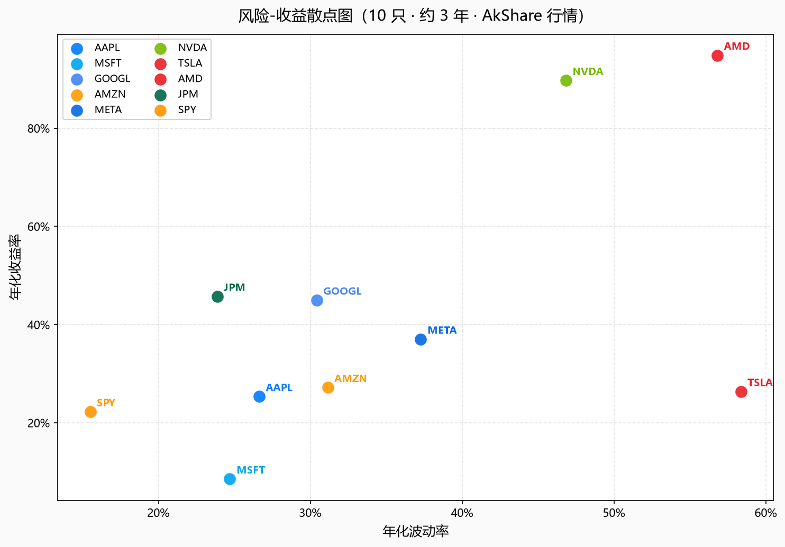
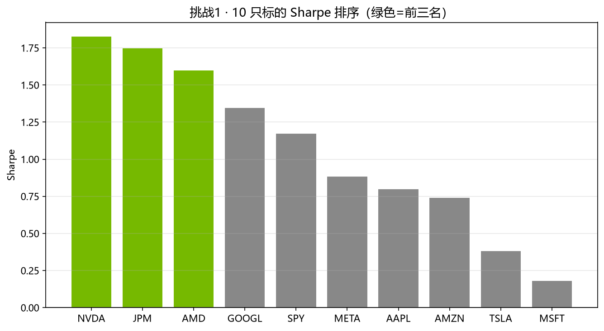
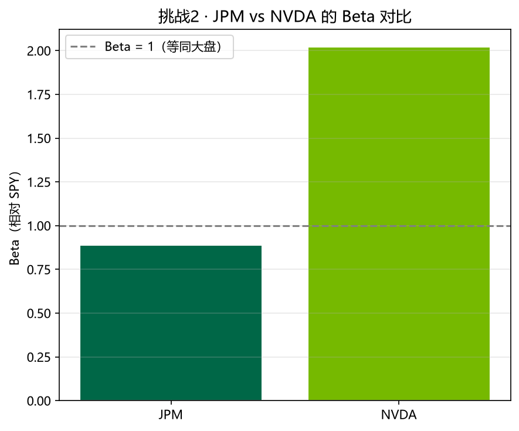
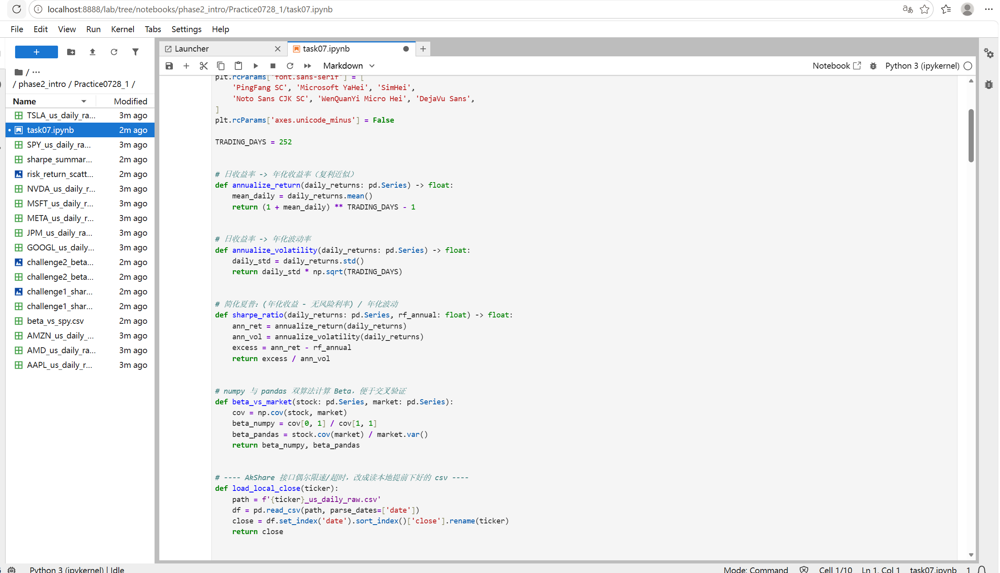

# Task7 第六章：夏普比率与 Beta 学习笔记

## 1. 今天学的 Task
Task7《第六章：夏普比率与 Beta》。

## 2. 完成了哪些课程要求
- 理解了为什么**只看收益率不够**：同样赚钱，波动大三倍的那只，性价比可能反而更差
- 学会了算**夏普比率**：`Sharpe ≈ (年化收益 − 无风险利率) / 年化波动率`，无风险利率先用 4% 近似，数值代表每承担一单位风险能多赚多少
- 用 10 只标的（9 只个股 + SPY）画了**风险-收益散点图**，横轴波动、纵轴收益，一眼看性价比
- 学会了算**Beta**：`Beta = Cov(股票, 大盘) / Var(大盘)`，用 numpy 的 `cov` 手算，再用 pandas 的 `.cov()/.var()` 交叉验证，两种算法结果一致
- 用 Python 标准库 `statistics` 看了 AAPL 收益分布的均值、中位数、标准差，理解了中位数比均值更抗极端值干扰
- 完成了挑战任务（详见第3部分）：把 10 只标的按 Sharpe 从高到低排序找前三名、对比 JPM 和 NVDA 谁的 Beta 更贴近大盘、思考"Sharpe 高是否意味着未来一定更好"

## 3. 运行结果

### 基础实验

数据来源：本章教材用 AkShare 的 `stock_us_daily`（新浪财经美股日线）而不是 yfinance，提前用独立脚本把 10 只标的近 3 年数据下载好存成本地 csv，Notebook 里直接读本地文件。

样本区间：**2023-06-28 → 2026-07-24，共 770 个交易日**。AAPL 末收 333.02。

**6.1 风险收益一览（近似 Sharpe，rf=4%）：**

| 股票 | 年化收益 | 年化波动 | Sharpe |
|---|---|---|---|
| AAPL | 25.34% | 26.63% | 0.80 |
| MSFT | 8.54% | 24.69% | 0.18 |
| GOOGL | 44.97% | 30.41% | 1.35 |
| AMZN | 27.18% | 31.15% | 0.74 |
| META | 37.02% | 37.27% | 0.89 |
| NVDA | 89.70% | 46.82% | 1.83 |
| TSLA | 26.35% | 58.36% | 0.38 |
| AMD | 94.85% | 56.80% | 1.60 |
| JPM | 45.73% | 23.86% | 1.75 |
| SPY | 22.25% | 15.51% | 1.18 |

数据：[sharpe_summary.csv](quant_practice/task07/sharpe_summary.csv)

**6.2 风险-收益散点图（10 只 · 约 3 年）：**

- 

**6.3 Beta（相对 SPY，numpy / pandas 双算法对照）：**

| 股票 | Beta |
|---|---|
| TSLA | 2.22 |
| AMD | 2.23 |
| NVDA | 2.02 |
| META | 1.45 |
| AMZN | 1.37 |
| GOOGL | 1.15 |
| AAPL | 1.09 |
| MSFT | 0.94 |
| JPM | 0.89 |

两种算法（numpy 手算 vs pandas `.cov()/.var()`）结果完全一致，互相印证了公式没写错。数据：[beta_vs_spy.csv](quant_practice/task07/beta_vs_spy.csv)

**6.4 AAPL 日收益率分布（statistics 标准库）：**

- 均值：0.0897%
- 中位数：0.1237%
- 标准差：1.6764%
- 最大单日涨：+15.45%
- 最大单日跌：-9.30%

均值比中位数低，说明有个别极端下跌日把均值往下拉了一点，中位数受影响更小，更能代表"平常日子"的表现。

### 挑战任务

**挑战1**：10 只标的按 Sharpe 从高到低排序，找前三名

🏆 前三名：**NVDA（1.83）> JPM（1.75）> AMD（1.60）**

- 

数据：[challenge1_sharpe_rank.csv](quant_practice/task07/challenge1_sharpe_rank.csv)

有意思的是 JPM 一只传统银行股，年化波动只有 23.86%（10 只里最低之一），却挤进了 Sharpe 前三，说明"低波动 + 稳健收益"的组合也能有很高的性价比，不一定非要靠高收益堆出来。

**挑战2**：JPM vs NVDA，谁的 Beta 更贴近大盘 SPY？

| 股票 | Beta | 与1的距离 |
|---|---|---|
| JPM | 0.89 | 0.11 |
| NVDA | 2.02 | 1.02 |

结论：**JPM 更贴近大盘**（Beta 0.89，离 1 只差 0.11），NVDA 的 Beta 高达 2.02，大盘涨跌 1%，NVDA 平均要动 2% 左右。

- 

数据：[challenge2_beta_jpm_nvda.csv](quant_practice/task07/challenge2_beta_jpm_nvda.csv)

**挑战3**：Sharpe 高是否意味着未来一定更好？

Sharpe 是用历史数据算出来的，只能说明这只股票在过去这段时间里性价比高，不代表未来还会保持同样的收益和波动结构。就像第一期讲过的"回测不是算命"，Sharpe 排名靠前只是历史体检结果好，真要用它做决策还要结合当下的基本面和风险再判断。

## 4. 学习记录
遇到的问题：
- **教材换了数据源**：这一章不用 yfinance 了，改成 akshare 的 `ak.stock_us_daily`，接口和字段都不一样（返回的是 `date/open/high/low/close/volume` 这种小写列名，不是 yfinance 的多层索引），第一次读的时候按 yfinance 的习惯写 `raw['Close']` 报错，改成 `df['close']` 才对上
- **本地缓存同样管用**：虽然 akshare 这次联网没有像 yfinance 那样限流，但还是先用独立脚本把 10 只标的的数据一次性下载存本地 csv，Notebook 里读本地文件，避免反复调接口拖慢速度，也方便重复跑挑战任务时数据不会变

实验记录：

阅读教材时同步做的梳理笔记：[task07——夏普比率与Beta.md](task07——夏普比率与Beta.md)

## 5. 一个还没完全懂的问题
挑战1里发现 JPM（银行股）Sharpe 排到第二，仅次于 NVDA，年化波动却是10只里最低的几个之一；而 AAPL 年化收益不算低（25.34%），Sharpe 反而只有 0.80，排到中下游。是不是说明"性价比"这个东西跟收益高低关系不大，主要看收益相对波动的"稳定程度"，而不是简单地"赚得多就性价比高"？
