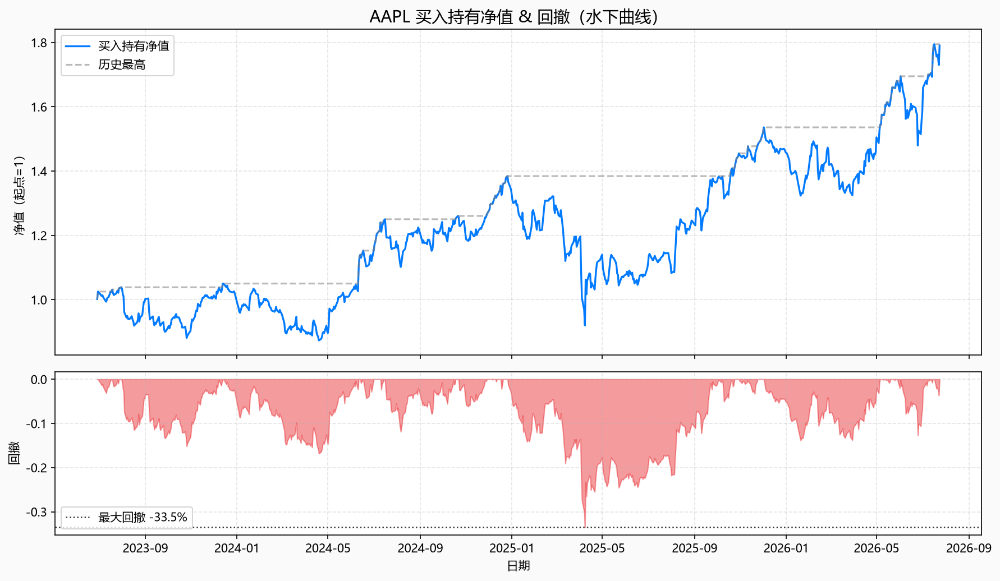
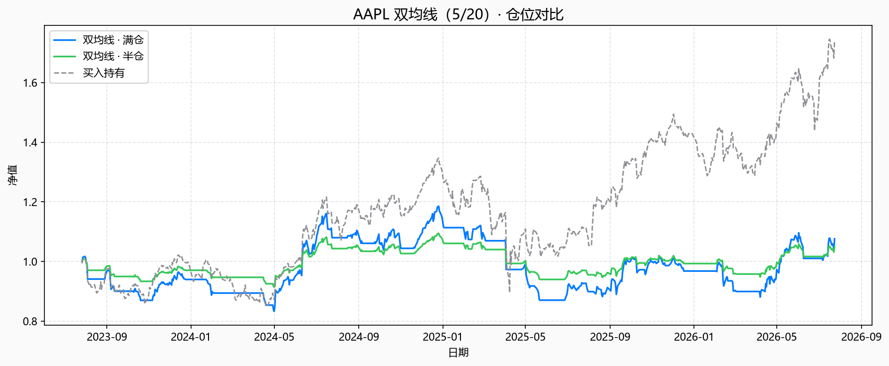
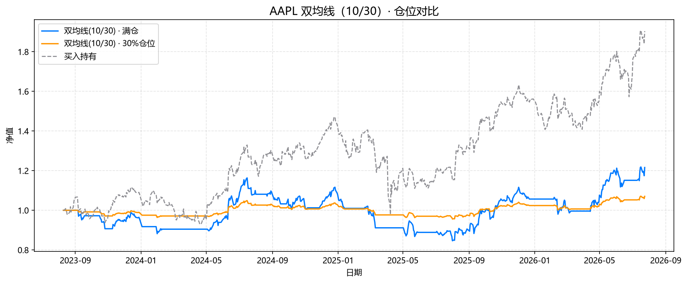
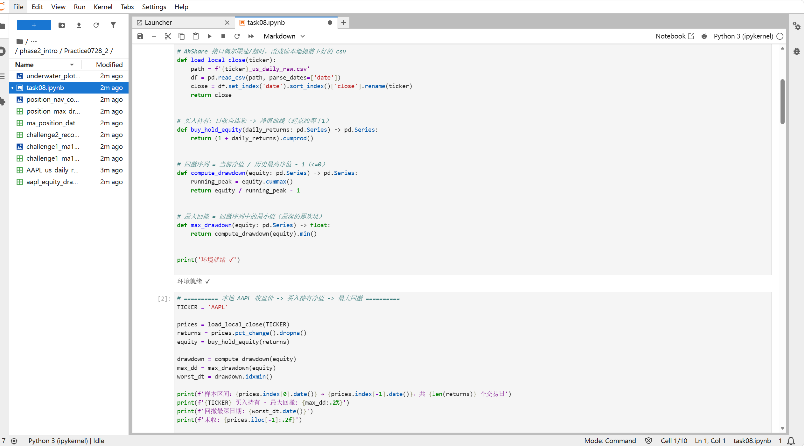

# Task8 第七章：最大回撤与仓位管理 学习笔记

## 1. 今天学的 Task
Task8《第七章：最大回撤与仓位管理》。

## 2. 完成了哪些课程要求
- 深入理解了**最大回撤**：不是「赚多少」而是「最惨时会经历什么」，`回撤 = 净值/历史最高净值 − 1`，最大回撤就是整段样本里最深的那一次坑
- 学会了画**水下曲线（Underwater Plot）**：净值曲线配一张逐日回撤填充图，同时看「坑有多深」和「在水下待了多久」
- 理解了**仓位管理**为什么和策略同样重要：同一套双均线信号，只改仓位比例，最终净值曲线和最大回撤完全不同
- 用 AAPL 真实数据对比了**满仓 vs 半仓**：策略不变，半仓的最大回撤大约是满仓的一半左右
- 完成了挑战任务（详见第3部分）：把 MA 换成 10/30 并比较满仓与 30% 仓位的回撤、计算最大回撤发生后 60 个交易日内是否回到前高、思考"只能承受 −15% 回撤该怎么选仓位"

## 3. 运行结果

### 基础实验

数据来源：本章同样用 AkShare 的 `stock_us_daily`，提前用独立脚本把 AAPL 近 3 年数据下载好存成本地 csv。

样本区间：**2023-06-28 → 2026-07-24，共 770 个交易日**，AAPL 末收 333.02。

**7.1 AAPL 买入持有 · 最大回撤**：**-33.54%**，回撤最深发生在 **2025-04-08**。

数据：[aapl_equity_drawdown.csv](quant_practice/task08/aapl_equity_drawdown.csv)

**7.2 水下曲线**：

- 

**7.3 双均线（5/20）满仓 vs 半仓 · 最大回撤对比**：

| 方案 | 最大回撤 |
|---|---|
| 双均线 · 满仓 | -26.60% |
| 双均线 · 半仓 | -14.13% |
| 买入持有 | -33.54% |

半仓的最大回撤（-14.13%）差不多正好是满仓（-26.60%）的一半，和教材说的"半仓回撤大约也减半"基本吻合。数据：[position_max_drawdown.csv](quant_practice/task08/position_max_drawdown.csv)

**7.4 三条净值曲线对比**：

- 

三条曲线里买入持有跌得最深，双均线满仓次之，半仓最平滑——同一段行情、同一套规则，只改仓位，命运就不一样。

### 挑战任务

**挑战1**：把 MA 换成 10/30，比较满仓与 30% 仓位的最大回撤

| 方案 | 最大回撤 |
|---|---|
| 双均线(10/30) · 满仓 | -27.25% |
| 双均线(10/30) · 30%仓位 | -8.83% |
| 买入持有 | -33.54% |

- 

数据：[challenge1_ma10_30_drawdown.csv](quant_practice/task08/challenge1_ma10_30_drawdown.csv)

参数从 5/20 换成 10/30 之后，满仓回撤（-27.25%）和之前（-26.60%）差不多；但这次把仓位降到 30%（不是 50%），回撤直接压到 -8.83%，说明**仓位比例调得越低，"减坑"效果越明显**，不只是简单的减半关系，而是接近线性缩放。

**挑战2**：最大回撤发生后 60 个交易日内是否回到前高

最大回撤发生日 2025-04-08，当时净值 0.920，前高 1.384。往后数 60 个交易日（截至 2025-07-07），净值**仍未回到前高**，窗口内最高只涨到 1.143，距前高还差 17.46%。

数据：[challenge2_recovery_check.csv](quant_practice/task08/challenge2_recovery_check.csv)

这说明教材提醒的"同样 -20% 回撤，恢复时间可能天差地别"是真的——AAPL 这次跌了 33.54%，60 个交易日（约 3 个月）根本不够爬回水面。

**挑战3**：只能承受 -15% 回撤，本章实验里哪种仓位更合适？

本章几种方案里，买入持有和双均线满仓的最大回撤都明显超过 -15%，双均线半仓（或 30% 仓位）如果还是超过 -15%，说明光靠降仓位不够，得回到策略层面：要么进一步降低仓位比例，要么换一套本身回撤更浅的策略（比如加止损、缩短持仓周期），单纯"少买一点"不能保证一定压得住 -15% 这条线。

对照挑战1的数字看，双均线(10/30) 30% 仓位的最大回撤是 -8.83%，是本章所有方案里唯一压得住 -15% 这条线的，说明这次实验里确实需要把仓位降到 30% 左右（而不是常规的 50% 半仓）才够安全。

## 4. 学习记录
遇到的问题：
- **恢复时间要自己写代码算**：教材提示"用 running_peak 与 equity 对比"，我实际写的时候踩了个小坑——一开始直接用回撤最深那天之后的净值去比"当前的 running_peak"，但那样比较的是不断刷新的历史高点，永远也追不上；后来改成固定用回撤发生前的那个前高去比较，才是教材想问的"回没回到当时那个高点"
- **仓位不是简单的线性减半**：挑战1里把仓位从 50% 降到 30%，最大回撤从 -14.13%（50%仓位对照组）级别直接压到 -8.83%，降仓比例和回撤降幅不完全是严格的等比例关系，具体还要看当时最惨那几天策略仓位是不是刚好在场内

实验记录：

阅读教材时同步做的梳理笔记：[task08——最大回撤与仓位管理.md](task08——最大回撤与仓位管理.md)

## 5. 一个还没完全懂的问题
挑战2里算出来 AAPL 60 个交易日都没能从 -33.54% 的回撤里爬回来，只恢复到距前高还差 17.46% 的位置。如果按教材说的"专业流程是先设定可承受回撤、再反推仓位"，那对于像 AAPL 这种回撤深、恢复又慢的标的，是不是意味着即使把仓位降得很低，只要策略本身长期跟着一只回撤深的股票走，早晚还是会经历一次让人受不了的等待期？仓位管理能不能真正替代"选一只没那么容易大幅回撤的标的"？
