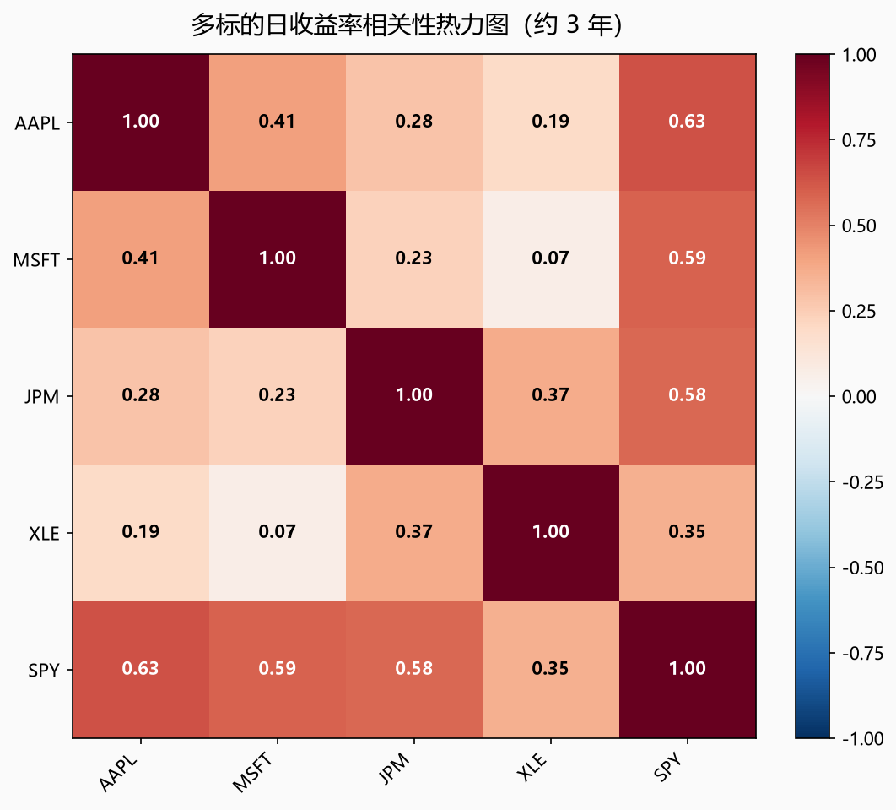
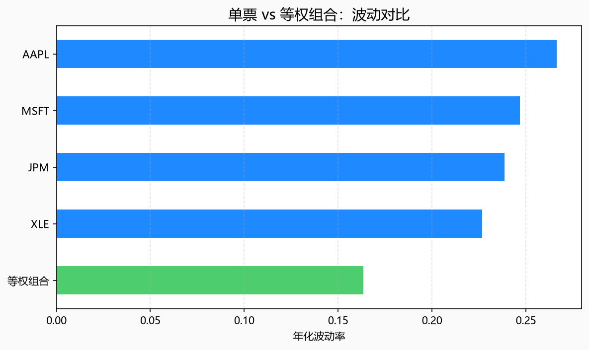
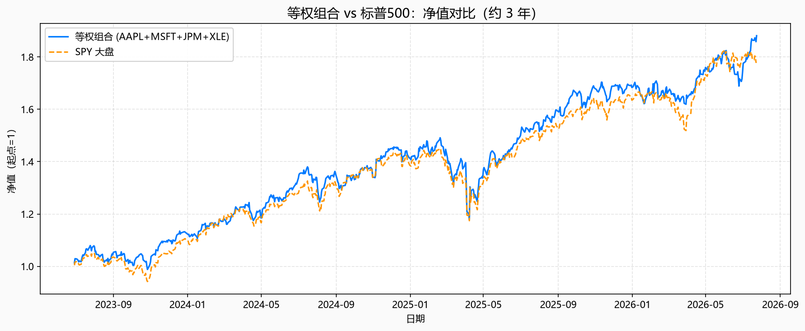
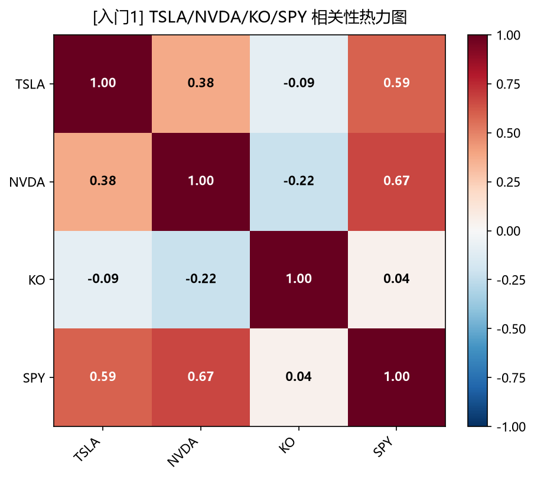
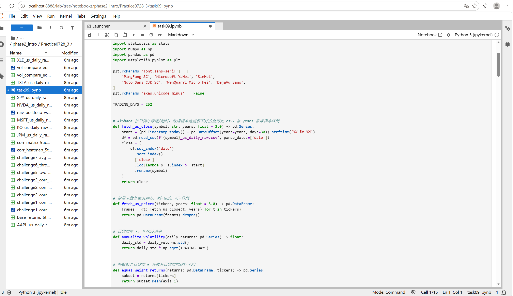

# Task9 第八章：多标的组合与相关性 学习笔记

## 1. 今天学的 Task
Task9《第八章：多标的组合与相关性》（Phase 2 收官章节）。

## 2. 完成了哪些课程要求
- 学会了把**多只股票下载并对齐成一张宽表**：行=交易日，列=标的，用 `dropna()` 只保留所有标的都有报价的共同交易日
- 学会了算**相关性矩阵**：`returns.corr()` 一行代码得到 Pearson 相关系数 ρ，理解 ρ≈1（同涨同跌）、ρ≈0（各走各的）、ρ≈-1（少见的反向）分别对分散投资意味着什么
- 学会了画**相关性热力图**：用颜色代替数字表格，一眼看出"谁和谁绑在一起"
- 用 AAPL/MSFT/JPM/XLE 四只标的构造了**等权组合**，亲手验证了组合波动是否低于单票
- 画了**等权组合 vs SPY 净值曲线对比图**，看这段样本组合是跑赢还是跑输大盘
- 完成了挑战任务（详见第3部分）：入门1-3（换标的、换样本长度、三张关键图打卡）+ 进阶4-7（找低相关一对、不等权实验、三票组合对比、组合波动 vs 单票平均），达到"入门3项+进阶2项"的通关标准并额外多做了2项进阶

## 3. 运行结果

### 基础实验

数据来源：本章同样用 AkShare 的 `stock_us_daily`，提前用独立脚本把 AAPL/MSFT/JPM/XLE/SPY/TSLA/NVDA/KO 共 8 只标的的全部历史行情下载好存成本地 csv，Notebook 里按需截取样本区间。

**8.1 五只标的宽表对齐**：样本 **770 个交易日 × 5 只标的**，区间 **2023-06-29 → 2026-07-24**。数据：[base_returns_5tickers.csv](quant_practice/task09/base_returns_5tickers.csv)

**8.2 相关性矩阵**（约 3 年）：

| | AAPL | MSFT | JPM | XLE | SPY |
|---|---|---|---|---|---|
| AAPL | 1.00 | 0.41 | 0.28 | 0.19 | 0.63 |
| MSFT | 0.41 | 1.00 | 0.23 | 0.07 | 0.59 |
| JPM | 0.28 | 0.23 | 1.00 | 0.37 | 0.58 |
| XLE | 0.19 | 0.07 | 0.37 | 1.00 | 0.35 |
| SPY | 0.63 | 0.59 | 0.58 | 0.35 | 1.00 |

最低相关一对：**MSFT ↔ XLE，ρ = 0.07**（科技和能源，几乎不同步）；非 SPY 里最高的一对是 **AAPL ↔ MSFT，ρ = 0.41**（两只科技龙头相对更同步，但并没有教材说的 0.75+ 那么夸张）。数据：[corr_matrix_5tickers.csv](quant_practice/task09/corr_matrix_5tickers.csv)

**8.3 相关性热力图**：

- 

**8.4 等权组合（AAPL+MSFT+JPM+XLE）vs 单票年化波动**：

| | 年化波动率 |
|---|---|
| 等权组合 | 16.34% |
| XLE | 22.67% |
| JPM | 23.86% |
| MSFT | 24.69% |
| AAPL | 26.63% |

组合波动 **16.34%**，比 4 只单票里波动最低的 XLE（22.67%）还要低，分散化红利非常明显。数据：[vol_compare_equal_weight.csv](quant_practice/task09/vol_compare_equal_weight.csv)

- 

**8.5 等权组合 vs SPY 净值对比**：

- 

等权组合末净值 **1.881（+88.12%）**，SPY 末净值 **1.781（+78.12%）**，这段样本里组合小幅跑赢大盘，同时波动（16.34%）也明显低于任意单票。

### 挑战任务

**入门1 · 换标的（TSLA/NVDA/KO/SPY）**：

| | TSLA | NVDA | KO | SPY |
|---|---|---|---|---|
| TSLA | 1.00 | 0.38 | -0.09 | 0.59 |
| NVDA | 0.38 | 1.00 | -0.22 | 0.67 |
| KO | -0.09 | -0.22 | 1.00 | 0.04 |
| SPY | 0.59 | 0.67 | 0.04 | 1.00 |

- 

KO（可口可乐）和 TSLA/NVDA 是**负相关**（-0.09、-0.22），跟前面 5 只标的组里全是正相关不一样，说明消费防御股确实和高成长科技股走的是不同的剧本。数据：[challenge1_corr_matrix_tsla_nvda_ko_spy.csv](quant_practice/task09/challenge1_corr_matrix_tsla_nvda_ko_spy.csv)

**入门2 · 换样本长度（1年 vs 5年）**：

- 1年（268 个交易日）：AAPL-SPY ρ=0.44，普遍偏低，甚至 XLE 和其他标的多数是负相关
- 5年（1273 个交易日）：AAPL-SPY ρ=0.74，AAPL-MSFT ρ=0.58，普遍比 1 年期更高

5 年 - 1 年的相关系数差异全部是**正数**（最大差异 XLE-SPY 相差 0.515），说明拉长样本后各标的相关性明显**升高**，短期内的"各走各的"在长周期下会更趋同。数据：[challenge2_corr_matrix_1y.csv](quant_practice/task09/challenge2_corr_matrix_1y.csv) / [challenge2_corr_matrix_5y.csv](quant_practice/task09/challenge2_corr_matrix_5y.csv) / [challenge2_corr_diff_5y_minus_1y.csv](quant_practice/task09/challenge2_corr_diff_5y_minus_1y.csv)

**入门3 · 截图打卡**：保存了热力图、波动柱状图、组合 vs SPY 净值对比图三张关键图（见上）。我发现了 AAPL 和 MSFT 相关最高（两只科技龙头同涨同跌最明显），XLE 和其他标的相关最低。

**进阶4 · 找低相关一对**：ρ 最低的一对是 **MSFT ↔ XLE（0.07）**。它远没有接近 -1，说明不是"一涨一跌"的对冲关系，只是"相对不那么同步"，组合在一起仍然能压低一部分波动，但不能指望靠它们对冲亏损。

**进阶5 · 不等权实验（0.5×AAPL + 0.5×MSFT vs 四票等权）**：

| | 年化波动率 |
|---|---|
| 0.5×AAPL + 0.5×MSFT | 21.55% |
| 四票等权 | 16.34% |

两只科技龙头的组合波动（21.55%）明显更高——因为 AAPL 和 MSFT 相关性相对更高，押注两个走势更同步的标的，分散效果差，波动没怎么被压下来。数据：[challenge5_two_vs_four_vol.csv](quant_practice/task09/challenge5_two_vs_four_vol.csv)

**进阶6 · 三票组合（AAPL+JPM+XLE）vs 四票等权**：

| | 年化波动率 |
|---|---|
| 三票(AAPL+JPM+XLE) | 17.58% |
| 四票(+MSFT) | 16.34% |

加入 MSFT 之后组合波动反而**下降**了（17.58% → 16.34%），说明虽然 MSFT 和 AAPL 相关性稍高，但 MSFT 自身波动不算最高，加进来整体还是拉低了组合波动——多元化的效果和"这只新标的自己有多稳"也有关系，不是只看它和别人像不像。数据：[challenge6_three_vs_four_vol.csv](quant_practice/task09/challenge6_three_vs_four_vol.csv)

**进阶7 · 组合波动 vs 单票波动的简单平均**：

| | 年化波动率 |
|---|---|
| 四票波动简单平均 | 24.46% |
| 等权组合实际波动 | 16.34% |

组合波动比四票简单平均低了整整 **8.12 个百分点**——这就是分散化的数值证据：组合波动不是各成分波动的平均，而是因为标的间不完全相关，实际波动会明显更低。数据：[challenge7_avg_vs_actual_vol.csv](quant_practice/task09/challenge7_avg_vs_actual_vol.csv)

## 4. 学习记录
遇到的问题：
- **本地全历史 CSV + 按需截取更省心**：这次没有像之前几章那样为每个 period（1y/3y/5y）单独下载一份 csv，而是每只标的只下载一次「全部历史」，Notebook 里写了个 `fetch_us_close(symbol, years)` 函数按 `years` 参数从本地全历史里现截取样本区间——这样入门2 里同时要用 1年/3年/5年三种窗口时，不用重复下载，直接改参数就行
- **相关性不是想象中那么高**：教材原文说 AAPL-MSFT"通常 0.75+"，但我这次实际算出来只有 0.41，说明相关性会随抽样区间、市场环境变化，教材给的是「典型现象」不是固定值，拿到自己手上跑出来的数字才是真实的

实验记录：

阅读教材时同步做的梳理笔记：[task09——多标的组合与相关性.md](task09——多标的组合与相关性.md)

## 5. 一个还没完全懂的问题
进阶6里发现，往三票组合（AAPL+JPM+XLE，17.58%）里加一只和 AAPL 相关性相对更高的 MSFT，组合波动反而降到了 16.34%，比进阶5里两只高相关科技股组合（21.55%）低很多。这是不是说明「组合波动会不会下降」除了看新加入标的和已有成分的相关系数，还要看这只新标的自己的波动率高不高——如果它自身波动足够低，即使相关性稍高，加进来也可能拉低整体波动？这两个因素（相关性、自身波动）到底谁的影响更大，有没有更直接的公式能一眼看出来？
